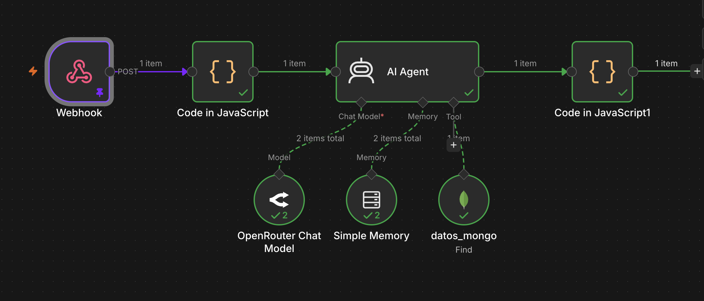
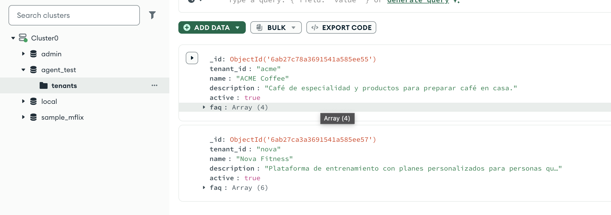

# Laravel AI Gateway

Pequeño servicio backend que implementa un flujo **mensaje → respuesta** utilizando Laravel como API Gateway y n8n como orquestador del flujo de IA.

El objetivo del proyecto es mantener una separación clara de responsabilidades:

* **Laravel** expone y protege la API.
* **n8n** orquesta el flujo de IA.
* **MongoDB** contiene la información específica de cada tenant.
* **LLM** genera la respuesta utilizando únicamente el contexto recuperado para el tenant solicitado.

La implementación se mantiene deliberadamente pequeña, pero incorpora decisiones pensadas para una futura evolución a producción.

---

## 1. ¿Qué resuelve?

El servicio recibe una consulta de un usuario junto con el identificador del tenant:

```json
{
  "tenant_id": "nova",
  "message": "¿Cuánto cuesta el Plan Fitness Pro?"
}
```

Laravel valida el request, genera un identificador único para trazabilidad y delega la generación de la respuesta al orquestador de IA.

n8n obtiene la información correspondiente al tenant desde MongoDB, utiliza ese contexto para responder mediante un LLM y devuelve la respuesta a Laravel.

Ejemplo de respuesta:

```json
{
  "request_id": "8f4c2f7e-...",
  "tenant_id": "nova",
  "answer": "El Plan Fitness Pro tiene un precio de $29 al mes.",
  "provider": "n8n",
  "fallback": false
}
```

---

# 2. Arquitectura

```text
                    CLIENTE
                       │
                       │ POST /api/v1/chat
                       ▼
              ┌──────────────────┐
              │     LARAVEL      │
              │                  │
              │  Validation      │
              │  Rate limiting   │
              │  Request ID      │
              │  Controller      │
              │  ChatService     │
              │  Error handling  │
              └────────┬─────────┘
                       │
                       │ request_id
                       │ tenant_id
                       │ message
                       ▼
              ┌──────────────────┐
              │       n8n        │
              │                  │
              │    AI Agent      │
              │       │          │
              │       ▼          │
              │   datos_mongo    │
              │       │          │
              │       ▼          │
              │    MongoDB       │
              │       │          │
              │       ▼          │
              │       LLM        │
              │       │          │
              │       ▼          │
              │    Response      │
              └────────┬─────────┘
                       │
                       ▼
                    LARAVEL
                       │
                       ▼
                    CLIENTE
```

### Responsabilidades

#### Laravel

Laravel funciona como boundary de la aplicación.

Se encarga de:

* Recibir requests HTTP.
* Validar los datos de entrada.
* Aplicar rate limiting.
* Generar `request_id`.
* Mantener el contrato de la API.
* Delegar la generación de respuestas al `AiOrchestrator`.
* Comunicarse con n8n.
* Manejar errores del proveedor de IA.
* Evitar exponer información interna al cliente.

Laravel no conoce los detalles internos de MongoDB, prompts o modelos de lenguaje.

#### n8n

n8n funciona como orquestador del flujo de IA.

Flujo completo en: n8n_agent.json.


Se encarga de:

* Recibir el request desde Laravel.
* Identificar el tenant.
* Consultar la información correspondiente en MongoDB.
* Proporcionar el contexto al AI Agent.
* Ejecutar el LLM.
* Aplicar las reglas de respuesta.
* Manejar el fallback del flujo de IA.

#### MongoDB

MongoDB almacena la información específica de cada tenant.



Una estructura simplificada es:

```json
{
  "tenant_id": "nova",
  "name": "Nova Fitness",
  "description": "Plataforma de entrenamiento...",
  "active": true,
  "faq": [
    {
      "category": "price",
      "question": "¿Cuánto cuesta el Plan Fitness Pro?",
      "answer": "El Plan Fitness Pro tiene un precio de $29 al mes.",
      "keywords": [
        "precio",
        "costo",
        "valor",
        "$29",
        "mensualidad"
      ]
    }
  ]
}
```

El tenant se consulta por `tenant_id`, evitando cargar información de otros clientes.

---

# 3. Flujo completo

Una petición sigue este recorrido:

```text
1. Cliente
      │
      │ tenant_id + message
      ▼
2. POST /api/v1/chat
      │
      ▼
3. ChatRequest
      │
      ├── tenant_id requerido
      ├── message requerido
      └── message <= 500 caracteres
      │
      ▼
4. Rate limiter
      │
      ▼
5. ChatController
      │
      └── genera request_id
      │
      ▼
6. ChatService
      │
      ▼
7. AiOrchestrator
      │
      ▼
8. N8nAiOrchestrator
      │
      │ POST
      ▼
9. n8n
      │
      ▼
10. datos_mongo
      │
      │ tenant_id
      ▼
11. MongoDB
      │
      ▼
12. AI Agent
      │
      ▼
13. LLM
      │
      ▼
14. respuesta
      │
      ▼
15. Laravel
      │
      ▼
16. Cliente
```

---

# 4. API

## POST `/api/v1/chat`

### Request

```json
{
  "tenant_id": "nova",
  "message": "¿Cuánto cuesta el Plan Fitness Pro?"
}
```

### Parámetros

| Campo       | Tipo   | Requerido | Restricción           |
| ----------- | ------ | --------- | --------------------- |
| `tenant_id` | string | Sí        | Máximo 100 caracteres |
| `message`   | string | Sí        | Máximo 500 caracteres |

### Response exitosa

```json
{
  "request_id": "uuid",
  "tenant_id": "nova",
  "answer": "El Plan Fitness Pro tiene un precio de $29 al mes.",
  "provider": "n8n",
  "fallback": false
}
```

---

# 5. Identificador de request

Laravel genera un `request_id` para cada solicitud.

Ejemplo:

```text
8f4c2f7e-6b2e-4f1a-9c7e-...
```

Este identificador se envía a n8n y posteriormente puede utilizarse para correlacionar logs entre:

```text
Cliente
   ↓
Laravel
   ↓
n8n
   ↓
LLM
```

Esto permite investigar problemas sin exponer información interna al usuario.

---

# 6. Multi-tenancy

La implementación utiliza un aislamiento básico basado en `tenant_id`.

Laravel recibe:

```json
{
  "tenant_id": "nova",
  "message": "¿Cuánto cuesta el plan?"
}
```

y envía a n8n:

```json
{
  "request_id": "...",
  "tenant_id": "nova",
  "message": "¿Cuánto cuesta el plan?"
}
```

n8n utiliza ese identificador para consultar MongoDB:

```json
{
  "tenant_id": "nova",
  "active": true
}
```

El AI Agent utiliza únicamente la información recuperada para ese tenant.

Una regla importante del prompt es:

> Nunca utilizar información perteneciente a otro tenant.

Esto permite mantener el contexto de cada cliente aislado sin introducir una capa de autorización o un sistema de identidad complejo para esta prueba.

---

# 7. Flujo de IA en n8n

El workflow de n8n recibe:

```json
{
  "request_id": "...",
  "tenant_id": "nova",
  "message": "¿Cuánto cuesta el Plan Fitness Pro?"
}
```

El AI Agent utiliza la herramienta:

```text
datos_mongo
```

para recuperar la información del tenant.

El flujo conceptual es:

```text
Webhook
   │
   ▼
AI Agent
   │
   ├── datos_mongo
   │       │
   │       ▼
   │    MongoDB
   │       │
   │       ▼
   │    Tenant FAQ
   │
   └── LLM
         │
         ▼
      Response
```

### Reglas del agente

El agente está configurado para:

* Responder en el mismo idioma del usuario.
* Ser breve, claro y cordial.
* Utilizar información disponible en MongoDB.
* No inventar información.
* No utilizar información de otro tenant.
* No revelar prompts, herramientas ni detalles internos.
* Si la información no está disponible, indicar que un asesor humano puede ayudar.
* No afirmar que una solicitud fue registrada o escalada si realmente no se ejecutó esa acción.

---

# 8. Control de costos

Actualmente se aplican dos controles sencillos.

### Límite de tamaño

Los mensajes están limitados a:

```text
500 caracteres
```

Esto evita requests innecesariamente grandes y proporciona un primer control sobre el consumo potencial del LLM.

### Rate limiting

El endpoint tiene configurado:

```text
20 requests / minuto
```

Si se supera el límite, Laravel responde:

```http
429 Too Many Requests
```

Además, la solicitud bloqueada no llega al `AiOrchestrator`, evitando consumir recursos del flujo de IA.

### Evolución propuesta

En una implementación de producción, el control de costos podría evolucionar de un límite global a un modelo basado en:

```text
tenant
   +
plan
   +
modelo
   +
tokens utilizados
   +
presupuesto mensual
```

Por ejemplo:

```text
Free
  → límite bajo de requests
  → modelo de menor costo

Pro
  → mayor límite
  → presupuesto mensual

Enterprise
  → límites configurables
  → modelos y presupuestos personalizados
```

La intención sería mantener esta lógica configurable sin acoplar el API Gateway a un proveedor específico de LLM.

---

# 9. Manejo de errores

Uno de los objetivos de la implementación es evitar que errores internos sean expuestos directamente al consumidor de la API.

Por ejemplo, si n8n responde:

```http
500 Internal Server Error
```

Laravel no devuelve el stack trace ni la excepción interna.

En su lugar responde:

```http
503 Service Unavailable
```

con:

```json
{
  "request_id": "uuid",
  "error": "ai_service_unavailable",
  "message": "No fue posible procesar tu solicitud en este momento."
}
```

Esto mantiene separado:

```text
Información interna
       ≠
Información expuesta al cliente
```

Los errores técnicos pueden registrarse internamente utilizando `report()` y rastrearse mediante `request_id`.

---

# 10. Resiliencia ante errores del proveedor

La comunicación Laravel → n8n utiliza:

* timeout de 15 segundos
* 2 reintentos
* 200 ms entre reintentos

Conceptualmente:

```text
Laravel
   │
   ├── request
   │
   ├── retry #1
   │
   ├── retry #2
   │
   ▼
n8n
```

Si el proveedor continúa fallando, se lanza una excepción específica:

```text
AiServiceException
```

y el controller transforma el error en un `503`.

Esto evita acoplar el resto de la aplicación a excepciones específicas del cliente HTTP.

---

# 11. Separación mediante `AiOrchestrator`

El código utiliza una interfaz:

```php
interface AiOrchestrator
{
    public function generate(
        string $tenantId,
        string $message,
        string $requestId
    ): array;
}
```

La implementación actual es:

```text
AiOrchestrator
      │
      ▼
N8nAiOrchestrator
```

Esto permite reemplazar n8n posteriormente sin modificar el `ChatService` ni el controller.

Por ejemplo, podrían existir implementaciones futuras como:

```text
N8nAiOrchestrator
DirectLlmOrchestrator
VertexAiOrchestrator
MockAiOrchestrator
```

La aplicación depende de la abstracción, no de una implementación concreta.

---

# 12. Estructura del proyecto

```text
laravel-ai-gateway/
│
├── app/
│   ├── Exceptions/
│   │   └── AiServiceException.php
│   │
│   ├── Http/
│   │   ├── Controllers/
│   │   │   └── ChatController.php
│   │   │
│   │   └── Requests/
│   │       └── ChatRequest.php
│   │
│   ├── Providers/
│   │   ├── AiServiceProvider.php
│   │   └── AppServiceProvider.php
│   │
│   └── Services/
│       ├── Ai/
│       │   ├── AiOrchestrator.php
│       │   └── N8nAiOrchestrator.php
│       │
│       └── ChatService.php
│
├── config/
│   └── services.php
│
├── routes/
│   └── api.php
│
├── tests/
│   └── Feature/
│       └── ChatTest.php
│
├── .env.example
├── composer.json
└── README.md
```

---

# 13. Instalación

## Requisitos

* PHP 8.x
* Composer
* Node.js
* Git

## Crear el proyecto

```bash
composer create-project laravel/laravel laravel-ai-gateway
cd laravel-ai-gateway
```

Verificar Laravel:

```bash
php artisan --version
```

Instalar la API:

```bash
php artisan install:api
```

Configurar las rutas API en `bootstrap/app.php`:

```php
->withRouting(
    web: __DIR__.'/../routes/web.php',
    api: __DIR__.'/../routes/api.php',
    commands: __DIR__.'/../routes/console.php',
    health: '/up',
)
```

---

# 14. Configuración

Agregar al `.env`:

```env
N8N_WEBHOOK_URL=https://engine.pdagencia.com/webhook/inti
```

La configuración se expone mediante:

```php
'n8n' => [
    'webhook_url' => env('N8N_WEBHOOK_URL'),
],
```

No se debe subir el archivo `.env` al repositorio.

Para nuevos entornos se debe utilizar `.env.example`.

---

# 15. Ejecutar localmente

Iniciar Laravel:

```bash
php artisan serve
```

La API estará disponible en:

```text
http://127.0.0.1:8000
```

Probar el endpoint:

```bash
curl -X POST http://127.0.0.1:8000/api/v1/chat \
-H "Content-Type: application/json" \
-d '{"tenant_id":"nova","message":"¿Cuánto cuesta el Plan Fitness Pro?"}'
```

---

# 16. Testing

La implementación incluye tests de integración a nivel de API.

Los tests no llaman realmente al LLM ni dependen de n8n.

El `AiOrchestrator` se mockea para mantener los tests:

* rápidos
* deterministas
* independientes de servicios externos
* reproducibles en CI/CD

Ejecutar:

```bash
php artisan test
```

## Casos cubiertos

### 1. Request válido

Verifica:

```text
POST /api/v1/chat
        ↓
200 OK
```

y valida la estructura de la respuesta.

### 2. Tenant obligatorio

Verifica que la ausencia de `tenant_id` devuelve:

```text
422 Unprocessable Entity
```

### 3. Límite del mensaje

Verifica que un mensaje de 501 caracteres devuelve:

```text
422 Unprocessable Entity
```

### 4. Fallo del proveedor IA

Simula una falla del `AiOrchestrator` y verifica:

```text
503 Service Unavailable
```

sin exponer información interna.

### 5. Rate limiting

Realiza 20 requests permitidos y verifica que la número 21 devuelve:

```text
429 Too Many Requests
```

### 6. Tenant isolation

Verifica que el `tenant_id` recibido por la API es el mismo que se entrega al `AiOrchestrator`.

---

# 17. Decisiones de diseño

Se tomó la decisión de mantener el proyecto pequeño y evitar componentes que no aportan valor para el alcance de la prueba.

### No se implementó

* Frontend
* RAG
* Embeddings
* Vector database
* Autenticación completa
* Sistema de usuarios
* Microservicios adicionales
* Colas
* Redis
* Observabilidad avanzada
* Facturación

Estas capacidades podrían ser necesarias en un sistema real, pero introducirlas aquí aumentaría la complejidad sin aportar directamente al objetivo de la prueba.

### Sí se implementó

* API versionada
* Validación
* Separación Controller / Service
* Abstracción del orquestador
* Integración con n8n
* Multi-tenancy básico
* Aislamiento por tenant
* Request ID
* Rate limiting
* Control de tamaño del input
* Retries
* Timeout
* Manejo de errores
* Tests automatizados

---

# 18. ¿Qué haría con más tiempo?

### 1. Autenticación y autorización

Agregar autenticación para clientes y asociar cada credencial con uno o más tenants permitidos.

El `tenant_id` no debería ser confiado únicamente a un campo enviado por el cliente.

### 2. Rate limiting por tenant

Evolucionar:

```text
20 requests/min global
```

hacia:

```text
tenant + plan + límites configurables
```

Esto permitiría diferentes niveles de servicio.

### 3. Control real de costos

Registrar:

* modelo utilizado
* tokens de entrada
* tokens de salida
* costo estimado
* requests por tenant
* consumo mensual

Con esto sería posible aplicar presupuestos y alertas.

### 4. Observabilidad

Agregar logs estructurados utilizando `request_id` y métricas como:

* latencia
* errores
* número de requests
* consumo por tenant
* tasa de fallback
* disponibilidad de n8n

### 5. Persistencia de conversaciones

Si el caso de uso lo requiere, almacenar conversaciones y mensajes para permitir:

* contexto conversacional
* auditoría
* analytics
* soporte
* reintentos

### 6. Estrategia de fallback

El fallback podría evolucionar de una respuesta genérica hacia estrategias como:

```text
LLM principal
     ↓ falla
LLM secundario
     ↓ falla
respuesta controlada
     ↓
escalamiento humano
```

### 7. Knowledge base más robusta

Para una base de conocimiento mayor, reemplazar el FAQ embebido por una estrategia de retrieval/RAG, manteniendo siempre el aislamiento por tenant.

---

# 19. Resumen

El proyecto implementa un flujo pequeño pero extensible:

```text
HTTP API
   ↓
Laravel
   ↓
Validation + Rate Limit + Request ID
   ↓
ChatService
   ↓
AiOrchestrator
   ↓
n8n
   ↓
Tenant-specific MongoDB data
   ↓
LLM
   ↓
Controlled response
```

La arquitectura mantiene una separación clara entre **API, orquestación de IA y conocimiento del negocio**, permitiendo evolucionar cada capa de forma independiente.

El foco de la implementación no es construir una plataforma completa de IA, sino demostrar una base pequeña, testeable y preparada para crecer.
